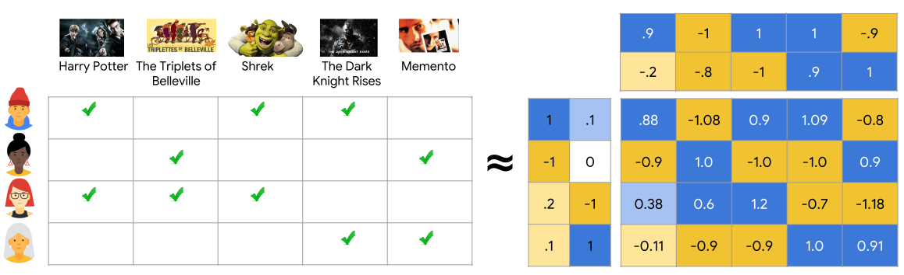

# Similar items

`similar` recommendation model can give you items other visitors also liked, while viewing the item you're currently observing. 

Common use-cases for this model are:
* you-may-also-like recommendations on item page: the context of the recommendation is a single item you're viewing now.
* also-purchased widget on the cart page: the context of the recommendation is the contents of your cart.

## Configuration

```yaml
  similar:
    type: als
    interactions: [click, like, purchase] # which interactions to use
    factors: 100 # optional, number of implicit factors in the model, default 100
    iterations: 100 # optional, number of training iterations, default 100
```

There are two important parameters in the configuration:
* `factors`: how many hidden parameters the model tries to compute. The more - the better, but slower. Usually defined within the rage of 50-500.
* `iterations`: how many factor refinement attempts are made. The more - the better, but slower. Normal range - 50-300.

Rule of thumb - set these parameters low, and then increase slightly until training time becomes completely unreasonable.

See request & response formats in the [API section](../../api.md#recommendations).

## Underlying model

Metarank uses a variation of [Matrix Factorization](https://developers.google.com/machine-learning/recommendation/collaborative/matrix) collaborative filtering algorithm for recommendations based on the [Fast Matrix Factorization for Online Recommendation with Implicit Feedback](https://arxiv.org/abs/1708.05024) by X.He, H.Zhang, MY.Kan and TS.Chua.



The ALS family of algorithms for recommendations decomposes a sparse matrix of user-item interactions into a set of smaller dense vectors of implicit user and item features (or user and item embeddings). The cool thing about these embeddings is that similar items will have similar embeddings!

So Metarank does the following:
* computes item embeddings.
* pre-builds a [HNSW](https://www.pinecone.io/learn/hnsw/) index for fast lookups for similar embeddings.
* during inference (when you call the [/recommend/modelname](../../api.md#recommendations) endpoint), it makes a k-NN index lookup of similar items.

Main pros and cons of such approach:
* *pros*: fast even for giant inventories, simple to implement
* *cons*: lower precision compared to neural networks based methods like [BERT4Rec](https://arxiv.org/abs/1904.06690), recommendations are not personalized.

*There is an ongoing work in Metarank project to implement NN-based methods and make current ALS implementation personalized.*
