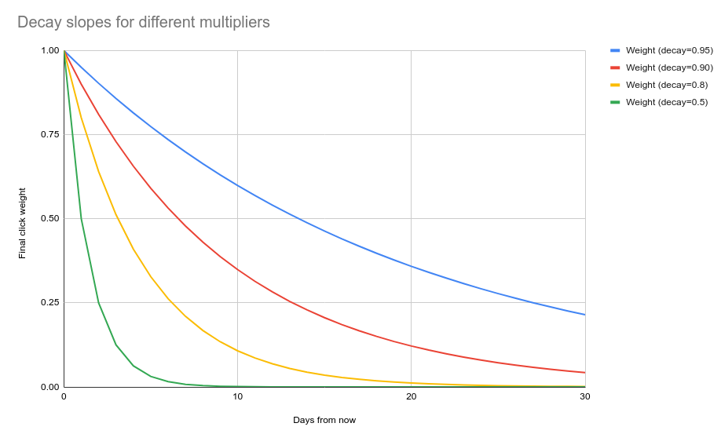

# Trending items

`trending` recommendation model is used to highlight the trending (or in other words, most popular) items in your application. But it's not just about sorting items by popularity! 

Metarank can:
* combine multiple types of interactions: you can mix clicks, likes and purchases with different weights.
* time decay: clicks made yesterday are much more important than the clicks from the last months.
* multiple configurations: trending over the last week, and bestsellers over the last year.

## Configuration

A separate block in the `models` section:
```yaml
models:
  yolo-trending:
    type: trending
    weights:
      - interaction: click
        decay: 0.8 # optional, default 1.0 - no decay
        weight: 1.0 # optional, default 1.0
        window: 30d # optional, default 30 days
      - interaction: like
        decay: 0.9
        weight: 1.5
        window: 60d
      - interaction: purchase
        decay: 0.95
        weight: 3.0
      
```

The config above defines a trending model, accessible over the `/recommend/yolo-trending` [API endpoint](../../api.md):
* the final item score combines click, like and purchase events
* purchase has 3x more weight than click, like has 1.5x more weight than click
* purchase has less agressive time decay
* only the last 30 days of data are used for clicks and purchases, but 60 days are used for likes

## Time decay and weight

The final score used to sort the items is defined by the following formula:
```
score = count * weight * decay ^ days_diff(now, timestamp)
```
When multiple interaction types are defined, per-type scores are added together to get the final score.

Time decay configuration allows a granular control over the decaying. Here's a click importance is weighted for different `decay` values:



We recommend setting decay:
* within a range of 0.8-0.95 for 1-month periods.
* within a range of 0.95-0.99 for larger periods.

See request & response formats in the [API section](../../api.md#recommendations).