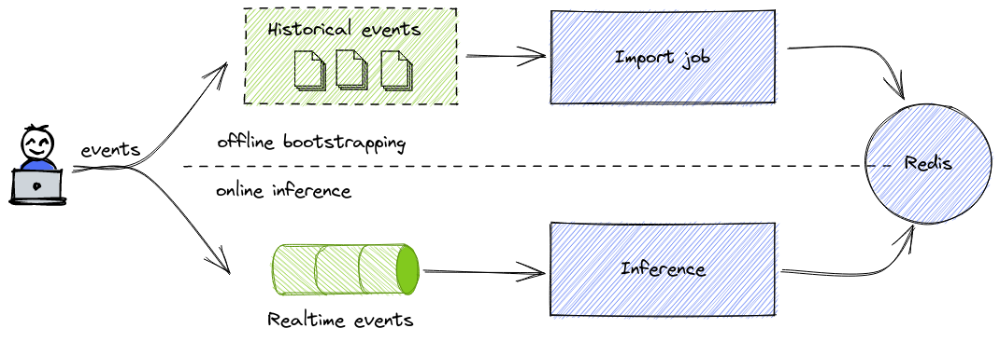

## Data sources

Metarank has two data processing stages:
* *bootstrapping*: consume historical visitor interaction events and produce latest point-in-time snapshot of the system 
and all the ML features. It's a one-time batch offline job, used for generating or updating a ML model.
* *inference*: loads the snapshot from the bootstrapping phase and continues processing live events that come realtime. It's
a continuous realtime online job.

An overview diagram of event flow during inference/bootstrap is shown below:


Metarank supports the following list of connectors:

| Name                                                       | Bootstrap              | Inference |
|------------------------------------------------------------|------------------------|-----------|
| [Apache Kafka](data-sources.md#apache-kafka)               | yes                    | yes       |
| [Apache Pulsar](data-sources.md#apache-pulsar)             | yes                    | yes       |
| [AWS Kinesis Streams](data-sources.md#aws-kinesis-streams) | yes, but actually no * | yes       |
| [RESTful API](data-sources.md#rest-api)                    | no                     | yes       |
| [Files](data-sources.md#files)                             | yes                    | no        |

`*` AWS Kinesis has a strict max 7 days retention period, so if you want to store more than 7
days of historical clickthrough events, choose something else (for example, add AWS 
Kinesis Firehose to write events from Kinesis topic to S3 files to pick them with `Files` 
connector).

## Bootstrapping data sources

### Common options for bootstrapping connectors

All supported connectors have some shared options:
* offset: a time window in which events are read
  * `earliest` - start from the first stored message in the topic
  * `latest` - consume only events that came recently (after Metarank connection)
  * `ts=<timestamp>` - start from a specific absolute timestamp in the past
  * `last=<duration>` - consume only events that happened within a defined relative duration (duration supports the
  following patterns: `1s`, `1m`, `1h`, `1d`)
* format: event record encoding format, possible options:
  * `json`: Both Json-line (newline separated records) and Json-array (`[{event:1}, {event:2}]`) formats are supported.
  * `snowplow:tsv|snowplow:json` - Snowplow-native format, see [Snowplow integration](integrations/snowplow.md) for details
  on how to set it up
* options (for kinesis/pulsar/kafka connectors): raw flink custom connector options to override default behavior:
  * kafka: [KafkaSourceOptions](https://github.com/apache/flink/blob/master/flink-connectors/flink-connector-kafka/src/main/java/org/apache/flink/connector/kafka/source/KafkaSourceOptions.java)
  and [ConsumerConfig](https://kafka.apache.org/24/javadoc/org/apache/kafka/clients/consumer/ConsumerConfig.html)
  * pulsar: [PulsarOptions](https://nightlies.apache.org/flink/flink-docs-master/docs/connectors/datastream/pulsar/#source-configurable-options)
  * kinesis: [AWSConfigConstants](https://github.com/apache/flink/blob/master/flink-connectors/flink-connector-aws-base/src/main/java/org/apache/flink/connector/aws/config/AWSConfigConstants.java) and
  [ConsumerConfigConstants](https://github.com/apache/flink/blob/master/flink-connectors/flink-connector-kinesis/src/main/java/org/apache/flink/streaming/connectors/kinesis/config/ConsumerConfigConstants.java)

An example of custom connector options:
```yaml
type: kinesis
options:
  flink.stream.efo.consumername: helloworld
  flink.stream.describe.backoff.base: '1000'
```

Please note that custom options are expected to be a string->string mapping, so numeric
options should be quoted according to YAML spec.

### File

Config file definition example:
```yaml
type: file
path: file:///ranklens/events/
offset: earliest|latest|ts=<unixtime>|last=<duration>
format: <json|snowplow:tsv|snowplow:json>
```

The *path* parameter supports the following possible access scheme formats:
* `file://` - read files from local directory recursively. Won't work with distributed deployments of Metarank, as 
`file://` prefix assumes a node-local access to the filesystem.
* `s3://` - read files from an S3 bucket.

For `file://` access scheme, note that according to the [RFC 1738](https://www.ietf.org/rfc/rfc1738.txt) file URL 
pointing to the localhost, may omit the `localhost` hostname and then must contain **THREE** slashes after the scheme. 
So a valid file URL example is `file:///data/events` (`file://data/events` means that `data` is a hostname and not a local file location).

So file URLs in Metarank should always use triple-slash prefix..

#### S3-like data storage
Check out [AWS S3 source documentation](deploy/aws-s3.md) for reading data from S3-like sources.


### Apache Kafka

[Apache Kafka](https://kafka.apache.org/) is an open source distributed event streaming platform. 

If you already use Kafka in your project, Metarank can connect to an existing Kafka topic to read incoming and stored events both for bootstraping (with an offset set to some time in the past)
and inference (when offset is set to `latest`) stages.

Kafka connector is configured in the following way:

```yaml
type: kafka
brokers: [broker1, broker2]
topic: events
groupId: metarank
offset: earliest|latest|ts=<unixtime>|last=<duration>
format: <json|snowplow:tsv|snowplow:json>
options: # optional flink connector raw parameters, map<string,string>
```

### Apache Pulsar

[Apache Pulsar](https://pulsar.apache.org/) is an open source distributed messaging and streaming platform.

If you already use Pulsar in your project, Metarank can connect to an existing Pulsar topic to read incoming and stored events both for bootstraping (with an offset set to some time in the past)
and inference (when offset is set to `latest`) stages.

Metarank supports Pulsar *2.8+*, but using *2.9+* is recommended. You can check [Apache Flink docs](https://nightlies.apache.org/flink/flink-docs-master/docs/connectors/datastream/pulsar/)
for a description of how the underlying connector works.

Pulsar connector is configured in the following way:
```yaml
type: pulsar
serviceUrl: <pulsar service URL>
adminUrl: <pulsar service HTTP admin URL>
topic: events
subscriptionName: metarank
subscriptionType: exclusive # options are exclusive, shared, failover
offset: earliest|latest|ts=<unixtime>|last=<duration>
format: <json|snowplow:tsv|snowplow:json>
options: # optional flink connector parameters, map<string,string>
```

## Inference data sources

Both [Pulsar](#apache-pulsar) and [Kafka](#apache-kafka) datasources can be used in the inference process as a source of real-time events. 
We recommend setting `offset` parameter to `latest` (or another value not too far back in time).

### AWS Kinesis Streams

[AWS Kinesis Streams](https://aws.amazon.com/kinesis/) is a fully-managed event streaming platform.
Metarank uses a connector for [Apache Flink](https://flink.apache.org) which is well-maintained and
feature complete.

To configure the connector, use this reference YAML block:
```yaml
type: kinesis
region: us-east-1
topic: events
offset: earliest|latest|ts=<unixtime>|last=<duration>
format: <json|snowplow:tsv|snowplow:json>
options: # optional custom options for Flink connector, map<string,string>
```

Important things to note when using AWS Kinesis connector for bootstrap:
* AWS Kinesis has a hard limit on [max retention time of 7 days](https://docs.aws.amazon.com/streams/latest/dev/service-sizes-and-limits.html).
If you want to store more data there, use AWS Firehose to offload these events to S3 and pick them with the `File` connector.
* AWS limits max throughput per shard to 2Mb/s, so it may take some time to pull large dataset
from kinesis. You may need to consider using an EFO consumer for a dedicated throughput.

To use an AWS EFO consumer with custom per-consumer dedicated throughput, check out the
[Flink AWS Kinesis Connector docs](https://nightlies.apache.org/flink/flink-docs-master/docs/connectors/datastream/kinesis/#using-enhanced-fan-out).
But in short, you need to set two separate extra options for the connector:
```yaml
type: kinesis
topic: events
region: us-east-1
offset: earliest|latest|ts=<unixtime>|last=<duration>
format: <json|snowplow:tsv|snowplow:json>
options: # optional custom options for Flink connector, map<string,string>
  flink.stream.recordpublisher: EFO # EFO | POLLING
  flink.stream.efo.consumername: metarank # custom consumer name 
```

#### AWS Authentication

Kinesis source uses a default auth chain from the AWS SDK, so all the possible ways of
authentication are supported, see the upstream [Flink Kinesis connector docs](https://nightlies.apache.org/flink/flink-docs-master/docs/connectors/datastream/kinesis/)
for details.

TLDR version for impatient:
* Use IAM roles when possible
* add AWS_ACCESS_KEY_ID and AWS_SECRET_ACCESS_KEY env vars to manually supply the keys.

### REST API

It's possible to ingest real-time feedback events directly using the REST API of Metarank. Under the hood, the API has 
two routes:
* `POST /feedback` - push feedback events to the internal buffer
* `GET /feedback` - pull all the collected feedback events from the buffer.

You can read more about Metarank REST API in the [API Documentation](api_schema.md);

Feedback processing job periodically polls the `/feedback` endpoint and processes all the events it emits. In other words, 
a REST API feedback ingestion has no persistence (restarted API causes data loss) and no failover (glitch in feedback processing
job means data loss). But it requires no external systems and is a wonderful tool for local dev runs in a playground.

REST connector is configured in the following way:
```yaml
    type: rest
    bufferSize: 1000 # optional, default 10000
    host: localhost # hostname of metarank API
    port: 8080 # port of metarank API
```
