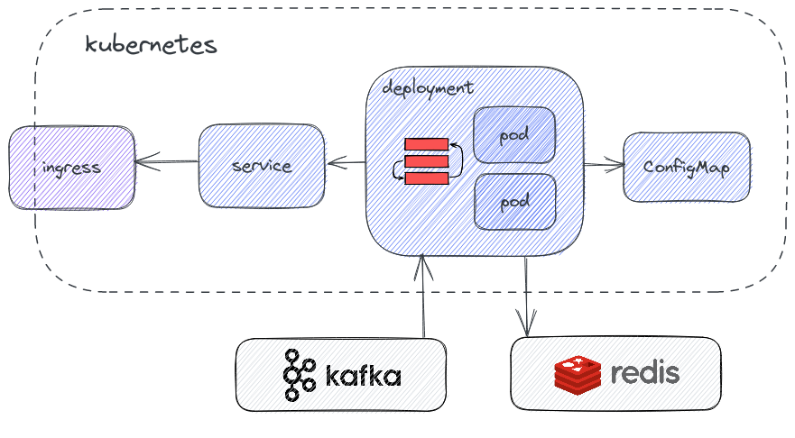

# Kubernetes deployment

Metarank can be deployed in a distributed fashion inside a Kubernetes cluster. 



## Prerequisites

For a distributed K8S deployment, metarank requires the following external services and tools to be already available:
1. Helm: used to install the Metarank chart.
2. Redis: as an almost-persistent data store for inference. Can be also installed either inside k8s with helm, or as a
   managed service like AWS ElastiCache Redis.
3. Distributed event bus for event ingestion: Kafka, Pulsar, Kinesis and internal RESTful API are supported.

## Data Import

Metarank supports multiple ways of ingesting training data into the system:
* event file can be HTTT POSTed to the `/feedback` endpoint using the [REST API](../api.md). Metarank does not do any in-memory buffering, so if your dataset is below 1GiB in size, this may be the simplest way to ingest.
* event can be imported from a Kafka/Pulsar/Kinesis topic or read from files **locally**. Note that distributed import is not yet supported.

We suggest to start with a HTTP-based event import, and switch to offline local import if you have any issues with it.

## Tuning the Helm chart

With Helm installed according to its official [installation guide](https://helm.sh/docs/intro/install/), you need to add a [Metarank Helm repo](https://github.com/metarank/helm-charts):

```shell
$> helm repo add metarank https://metarank.github.io/helm-charts
"metarank" has been added to your repositories

$> helm repo update
Hang tight while we grab the latest from your chart repositories...
...Successfully got an update from the "metarank" chart repository
Update Complete. Happy Helming!

$> helm pull metarank/metarank --untar
$> cd metarank
```

In the chart directory there are `metarank.conf` and `values.yaml` files you'll need to update before the deployment:
```shell
total 24
drwxr-xr-x 2 user user 4096 Oct  4 14:25 charts
-rw-r--r-- 1 user user  124 Oct  4 17:23 Chart.yaml
-rw-r--r-- 1 user user  376 Oct  4 17:23 metarank.conf
-rw-r--r-- 1 user user  989 Oct  4 17:23 README.md
drwxr-xr-x 3 user user 4096 Oct  4 17:23 templates
-rw-r--r-- 1 user user 1889 Oct  4 17:23 values.yaml
```

The `metarank.conf` file is a regular metarank configuration file, so you can check [the configuration guide](../configuration/overview.md) to set things up manually, or use an automatic [data-based config generator](../howto/autofeature.md). 

The `metarank.conf` file requires you to define a Redis endpoint for state store. A good-looking config file is shown below:
```yaml
api:
  host: 0.0.0.0

state:
  type: redis
  host: add-redis-hostname-here
  port: 6379

models:
  xgboost:
    type: lambdamart
    backend:
      type: xgboost
      iterations: 50
    weights:
      click: 1
    features:
      - popularity

features:
  - name: popularity
    type: number
    scope: item
    source: metadata.popularity
```

The `values.yaml` is a generic helm deployment configuration file. You can tune it, but default one **usually** requires no extra changes.

### Resources

The default helm chart sets no specific memory requests & limits, but it can be configured with `values.yaml`. 

The Metarank docker container accepts a `JAVA_OPTS` environment variable to control the JVM memory usage. It defaults to `JAVA_OPTS="-Xmx1g -verbose:gc"` which means:
* Use 1Gb for JVM heap. The actual RSS memory usage should be a bit higher due to JVM extra overhead.
* Enable verbose GC logging. You may notice the following lines in the log, they are normal:

```
[282.621s][info][gc] GC(26) Pause Young (Allocation Failure) 55M->36M(67M) 2.718ms 
```

## Installing the chart

The chart itself is agnostic to the Metarank version, and has separate versioning. For the latest Metarank `0.7.2` release, use the following command to install the chart:

```shell
helm install metarank . --set-file config=metarank.conf --set image.tag=0.7.2

NAME: metarank
LAST DEPLOYED: Tue Oct  4 15:32:47 2022
NAMESPACE: default
STATUS: deployed
REVISION: 1
```

After that, a single metarank pod will be running:
```shell
$> kubectl get pods
NAME                        READY   STATUS    RESTARTS   AGE
metarank-6c577f46f6-9c9mz   1/1     Running   0          136m
redis-master-0              1/1     Running   0          171m
```

## Next steps

After successful deployment you may want to do the following:
* Enable ingress in `values.yaml` so Metarank can be accessible from outside.
* HTTP POST the training data to the [`/feedback` REST API](../api.md#feedback).
* Send your first reranking request according to the [quickstart guide](../quickstart/quickstart.md)
* Configure Kafka/Pulsar/Kinesis as [a real-time data source](../configuration/data-sources.md).