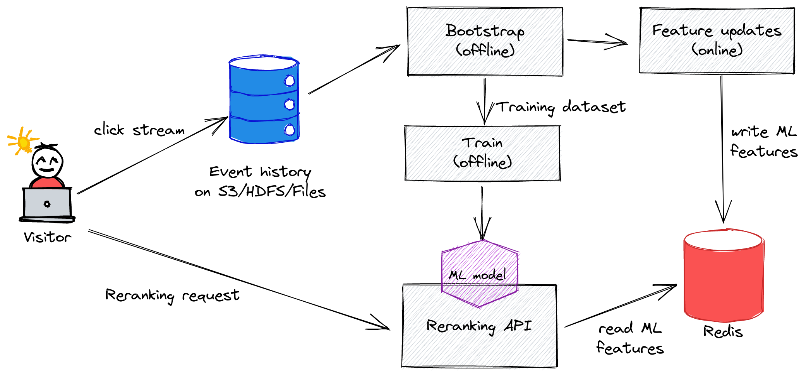
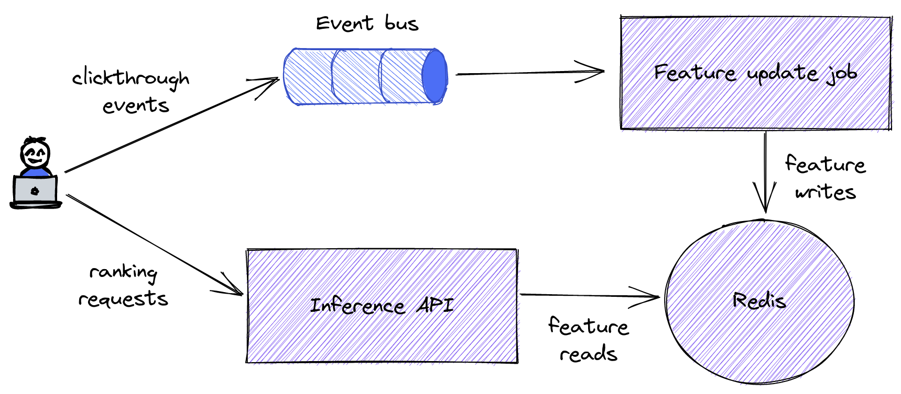
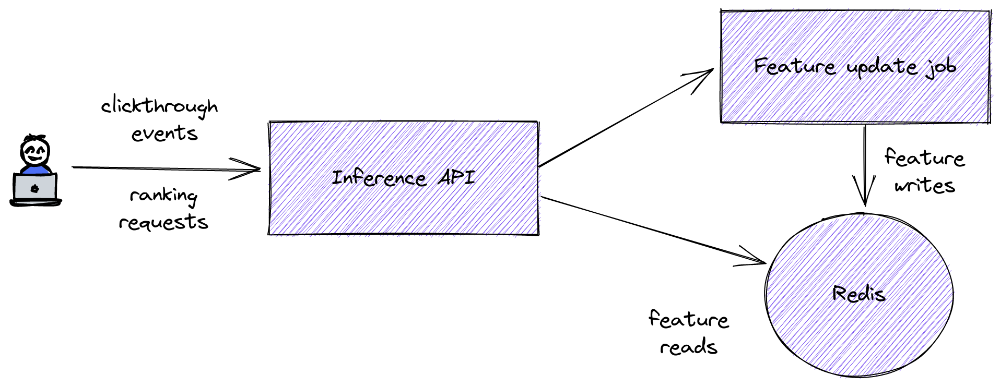

# Kubernetes deployment

## Intro

This document describes how you can run Metarank inside Kubernetes. In the following diagram an overall system
structure is shown:


Metarank deployment is a multi-stage process, consisting of these steps:
* bootstrap: import historical data, generate state snapshot. 
* train: train the ML model using the data from the bootstrap job.
* upload: load the current system state (from the bootstrap job) to redis for the inference.
* api: start the API to perform the reranking.
* update: start the job refreshing ML feature values in realtime.

### Local and distributed flavours of bootstrap

Both Bootstrap and Update jobs can be run as inside in Kubernetes in a distributed fashion,
and as local apps:
* distributed mode linearly scales and can handle large datasets, but requires
  more steps to set up. If your dataset is larger than 10GB, then you should consider
  this approach.
* local mode does not require any extra setup and runs on your local dev computer, but maybe slow
  for large input datasets.

Later in this document we assume:
* bootstrap, training and upload happens locally.
* feature update job and reranking API are run within kubernetes.

For a detailed description on setting up a distributed bootstrap job, check out [this chapter.](distributed-bootstrap.md)

## Requirements

For a distributed K8S deployment, metarank requires the following external services and tools to be already available:
1. Helm: used to install flink-k8s-operator
2. Redis: as an almost-persistent data store for inference. Can be also installed either inside k8s with helm, or as a
   managed service like AWS ElastiCache Redis.
3. Distributed filesystem or block storage. Good examples are S3, HDFS and CSI-based storage providers for Kubernetes.
   Used for periodic snapshots, state storage and job upgrades. Most of existing cloud providers have an S3-compatible
   object store (like GCE, AWS and DO), it should also work OK with Metarank.
4. Distributed event bus for event ingestion: Kafka, Pulsar, Kinesis and internal RESTful API are supported.



### Installing flink-kubernetes-operator

As Metarank data processing jobs (like bootstrap, upload and update) are implemented as an Apache
Flink streaming jobs, you need to have a Flink cluster available.
[Flink-kubernetes-operator](https://nightlies.apache.org/flink/flink-kubernetes-operator-docs-main/docs/concepts/overview/)
simplifies the process of creating Flink session clusters in k8s. Metarank-specific operator installations instructions
are available in [a separate chapter](flink-operator.md).

### S3 credentials

Metarank needs access to a S3-compatible block storage with the corresponding AWS_ACCESS_KEY_ID and AWS_SECRET_ACCESS_KEY
keys. You can take [secret.yml manifest](../../deploy/k8s-manifests/secret.yaml) as a template:
```yaml
apiVersion: v1
kind: Secret
metadata:
  name: metarank-keys
type: Opaque
data:
  AWS_ACCESS_KEY_ID: "<base64 encoded key>"
  AWS_SECRET_ACCESS_KEY: "<base64 encoded secret>"
```
You can either fill your base64-encoded key and secret there and load it with `kubectl apply -f secret.yml`, or create
from command line:
```bash
kubectl create secret generic metarank-keys \
  --from-literal=AWS_ACCESS_KEY_ID=supersecret \
  --from-literal=AWS_SECRET_ACCESS_KEY=topsecret
```

All the required manifests are present in the [deploy/k8s-manifests](../../deploy/k8s-manifests) directory.


### Configuration file

All parts of Metarank depend on a config file, describing the way input events are mapped to ML features. You can
take a [sample config.yml](../sample-config.yml) as a source of inspiration for your own one and load it as a k8s
configmap:
```bash
kubectl create configmap metarank-config --from-file=path/to/config.yml
```

### Bootstrapping

The bootstraping process:
1. Takes historical click data describing your user activity
2. Replays the complete click history
3. Computes all ML feature value updates and emits training dataset.
4. Stores last ML feature values
5. Stores last system state used to compute these last ML feature values.


### Local bootstrap

Local bootstrap requires you to have your `bootstrap.workdir` hosted on a distributed FS like S3. An example config file
(reduced version of a [ranklens demo config file](../../../src/test/resources/ranklens/config.yml)):
```yaml
bootstrap:
  source:
    type: file
    path: file:///home/user/events/ # event files can be local or S3, they're used only during bootstrap
  workdir: s3://metarank-tmp/ranklens/bootstrap/ # this should be S3/HDFS

inference:
  port: 8080
  host: "0.0.0.0"
  source:
    type: rest
  state:
    type: redis
    host: localhost
    format: protobuf

models:
  xgboost:
    type: lambdamart
    path: s3://metarank-tmp/ranklens/xgboost.model # should be S3/HDFS to allow API to pick it up
    backend:
      type: xgboost
      iterations: 10
    weights:
      click: 1
    features:
      - popularity
features:
  - name: popularity
    type: number
    scope: item
    source: metadata.popularity
```

For a local bootstrap, S3 access credentials need to be present as env variables `AWS_ACCESS_KEY_ID` and `AWS_SECRET_ACCESS_KEY`.
To run the bootstrap, do the following:
```bash
user@node ~ $ export AWS_ACCESS_KEY_ID="your-key"
user@node ~ $ export AWS_SECRET_ACCESS_KEY="swordfish"
user@node ~ $ export AWS_REGION="us-east-1"
user@node ~ $ java -jar metarank.jar bootstrap path/to/config.yml
```

After the job completes (usual estimated time is 1-2 minutes for datasets within 1Gb), you can validate that all the 
output files are present on the workdir S3 directory in the same way it's [done for a distributed bootstrap](distributed-bootstrap.md#validating-output).

### Training and feature values upload

After the boostrapping is done, you have to train the model and upload latest feature values to Redis:


To do a ML Model training locally, run the following command:

```bash
user@node ~ $ java -jar metarank.jar train path/to/config.yml <model name>

17:42:00.323 INFO  ai.metarank.mode.train.Train$ - reading S3Path(bucket,metarank/dataset-xgboost/2022-06-02--17/dataset-7af7b45f-6512-4500-8bf7-6c025092a807-0.json)
17:42:02.219 INFO  i.g.m.l.ranking.pairwise.LambdaMART - [0] NDCG@train = 0.8782615649854967 NDCG@test = 0.8746979991168132
17:42:02.278 INFO  i.g.m.l.ranking.pairwise.LambdaMART - [1] NDCG@train = 0.8793526557298176 NDCG@test = 0.8767574480228637
17:42:02.334 INFO  i.g.m.l.ranking.pairwise.LambdaMART - [2] NDCG@train = 0.8796958063507039 NDCG@test = 0.8775079992708243
17:42:02.402 INFO  i.g.m.l.ranking.pairwise.LambdaMART - [3] NDCG@train = 0.879507890508321 NDCG@test = 0.8779102306569908
17:42:02.463 INFO  i.g.m.l.ranking.pairwise.LambdaMART - [4] NDCG@train = 0.8797234663432965 NDCG@test = 0.8774868581086744
17:42:02.525 INFO  i.g.m.l.ranking.pairwise.LambdaMART - [5] NDCG@train = 0.8801232942819719 NDCG@test = 0.8779676481193128
17:42:02.584 INFO  i.g.m.l.ranking.pairwise.LambdaMART - [6] NDCG@train = 0.8806679004316218 NDCG@test = 0.8780901838783032
17:42:02.641 INFO  i.g.m.l.ranking.pairwise.LambdaMART - [7] NDCG@train = 0.8807530432217328 NDCG@test = 0.8787769459722111
17:42:02.735 INFO  i.g.m.l.ranking.pairwise.LambdaMART - [8] NDCG@train = 0.8809083224739541 NDCG@test = 0.8778854204425637
17:42:02.799 INFO  i.g.m.l.ranking.pairwise.LambdaMART - [9] NDCG@train = 0.8812462105044223 NDCG@test = 0.878187951989545
17:42:02.799 INFO  ai.metarank.rank.LambdaMARTModel - Feature stats (queries=7812, items=187488): 
17:42:02.909 INFO  ai.metarank.rank.LambdaMARTModel - popularity: zero=546 nonzero=186942 weight=107.0
17:42:02.909 INFO  ai.metarank.rank.LambdaMARTModel - vote_avg: zero=546 nonzero=186942 weight=95.0
17:42:02.909 INFO  ai.metarank.rank.LambdaMARTModel - vote_cnt: zero=546 nonzero=186942 weight=114.0
17:42:02.909 INFO  ai.metarank.rank.LambdaMARTModel - budget: zero=22266 nonzero=165222 weight=136.0
17:42:02.909 INFO  ai.metarank.rank.LambdaMARTModel - release_date: zero=546 nonzero=186942 weight=113.0
17:42:02.909 INFO  ai.metarank.rank.LambdaMARTModel - runtime: zero=546 nonzero=186942 weight=79.0
17:42:02.909 INFO  ai.metarank.rank.LambdaMARTModel - title_length: zero=546 nonzero=186942 weight=31.0
17:42:02.909 INFO  ai.metarank.rank.LambdaMARTModel - genre: zero=3421 nonzero=184067 weight=51.0
17:42:02.909 INFO  ai.metarank.rank.LambdaMARTModel - ctr_0: zero=693 nonzero=186795 weight=324.0
17:42:02.909 INFO  ai.metarank.rank.LambdaMARTModel - ctr_1: zero=693 nonzero=186795 weight=0.0
17:42:02.909 INFO  ai.metarank.rank.LambdaMARTModel - liked_genre: zero=80551 nonzero=106937 weight=117.0
17:42:02.909 INFO  ai.metarank.rank.LambdaMARTModel - liked_actors: zero=179353 nonzero=8135 weight=113.0
17:42:02.909 INFO  ai.metarank.rank.LambdaMARTModel - liked_tags: zero=179903 nonzero=7585 weight=53.0
17:42:02.909 INFO  ai.metarank.rank.LambdaMARTModel - liked_director: zero=169168 nonzero=18320 weight=29.0
17:42:02.909 INFO  ai.metarank.rank.LambdaMARTModel - visitor_click_count: zero=1776 nonzero=185712 weight=407.0
17:42:02.909 INFO  ai.metarank.rank.LambdaMARTModel - global_item_click_count: zero=693 nonzero=186795 weight=73.0
17:42:02.909 INFO  ai.metarank.rank.LambdaMARTModel - day_item_click_count_0: zero=693 nonzero=186795 weight=0.0
17:42:02.909 INFO  ai.metarank.rank.LambdaMARTModel - day_item_click_count_1: zero=693 nonzero=186795 weight=0.0

17:42:02.909 INFO  ai.metarank.rank.LambdaMARTModel - model written to S3Path(bucket, prefix/model.bin)
```

To upload the latest feature values to Redis, make sure that 
* `inference.state.type` is set to `redis` and you properly set redis hostname in 
`inference.state.host`. 
*  `AWS_REGION`, `AWS_ACCESS_KEY_ID` and `AWS_SECRET_ACCESS_KEY` env vars are defined

If ready to go, then run the following:

```bash
user@node ~ $ java -jar metarank.jar upload path/to/config.yml
```

### Feature update Flink job

Feature update job takes a savepoint generated by the bootstrap job, and continues computing
ML feature values from the time when bootstrap stopped.


To run this job, you need to generate the manifest and apply it to the k8s cluster:
```bash
user@node ~ $ metarank k8s-manifest config.yml update | kubectl apply -f
```

You can also dump the manifest to a file and add additional kubernetes-specific extensions
according to the [flink-kubernetes-operator docs](https://nightlies.apache.org/flink/flink-kubernetes-operator-docs-main/docs/custom-resource/overview/):
```yaml
kind: FlinkDeployment
metadata:
  name: metarank-update
spec:
  taskManager:
    resource:
      memory: 2048m
      cpu: 1.0
  image: metarank/metarank:0.4.0
  jobManager:
    resource:
      memory: 2048m
      cpu: 1.0
  job:
    entryClass: ai.metarank.mode.update.Update
    parallelism: 2
    args:
    - /config/config.conf
    state: running
    initialSavepointPath: s3://bucket/ranklens/bootstrap/savepoint
    upgradeMode: savepoint
    jarURI: local:///app/metarank.jar
  serviceAccount: flink
  flinkVersion: v1_15
  flinkConfiguration:
    high-availability: org.apache.flink.kubernetes.highavailability.KubernetesHaServicesFactory
    state.savepoints.dir: s3://bucket/ranklens/bootstrap/flink/savepoints
    taskmanager.numberOfTaskSlots: '1'
    high-availability.storageDir: s3://bucket/ranklens/bootstrap/flink/ha
    state.checkpoints.dir: s3://bucket/ranklens/bootstrap/flink/checkpoints
  podTemplate:
    apiVersion: v1
    kind: Pod
    metadata:
      name: pod-template
    spec:
      containers:
      - name: flink-main-container
        volumeMounts:
        - name: config
          mountPath: /config/
        env:
        - name: AWS_ACCESS_KEY_ID
          valueFrom:
            secretKeyRef:
              name: metarank-keys
              key: AWS_ACCESS_KEY_ID
        - name: AWS_SECRET_ACCESS_KEY
          valueFrom:
            secretKeyRef:
              name: metarank-keys
              key: AWS_SECRET_ACCESS_KEY
      volumes:
      - name: config
        configMap:
          name: metarank-config
```

## Inference API

The reranking API is a regular k8s deployment with the following tasks:
1. Load defined ML models
2. Pull ML features from Redis for reranking
3. Run the model inference
4. Build the JSON response.

Kubernetes YAML manifests for deploying the API are located in [/deploy/kubernetes](../../deploy/kubernetes)
directory. The deployment itself is looking like this:

```bash
user@node ~ $ kubectl create -f deployment.yml
user@node ~ $ kubectl create -f service.yml
user@node ~ $ kubectl create -f ingress.yml
```

Both deployment and service manifests require no extra tuning out-of-the-box, but you may
need to set a couple of minor things to proceed:
* to create the ingress you need to specify a Metarank hostname exposed outside.
* deployment uses a `us-east-1` AWS region by default, but you may need to change it if needed.

### Using Inference API as embedded event bus

In a cases when you have no Kafka/Pulsar/Kinesis available and have no plans deploying it
for Metarank exclusively, you can use Metarank's RESTful API as an event bus:



So instead of sending these events to the bus, you post them into the Metarank's `/feedback` 
[endpoint](../../api_schema.md) and the following happens:
* Events are buffered in in-memory queue inside the API
* Feature update job polls the API for updates
* If something is pulled from the queue, it's later processed as usual.

```yaml
inference:
  port: 8080
  host: "0.0.0.0"
  source: # a source of events to be processed in real-time
    # possible options are: kafka, pulsar, rest
    # kafka and pulsar definitions are the same as for the bootstrap.source section
    type: rest
    bufferSize: 1000 # optional (default 10000), size of an internal buffer for feedback events
    host: metarank-api # hostname of merarank API, should match k8s service name
    port: 8080 # its port
```

This approach has its own pros and cons:
* pro: No need to install Kafka/Pulsar/Kinesis.
* con: No persistence, losing all enqueued events on API restart.
* con: Cannot be used a long-term storage of historical clickthrough events.

We recommend using a RESTful source only for small-scale and staging deployments, and 
advice migrating to more stable solutions for production usage.