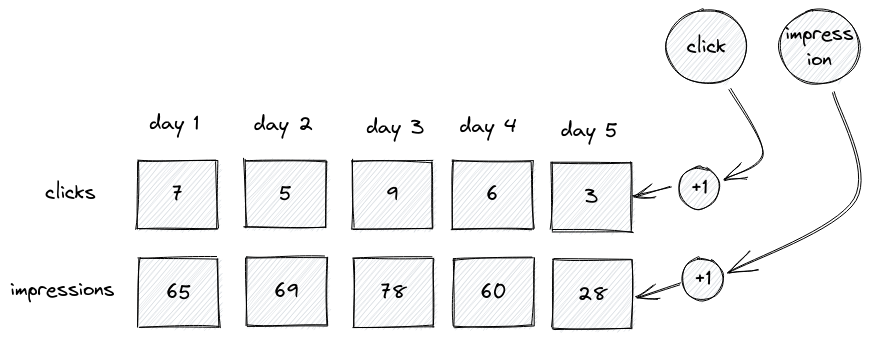
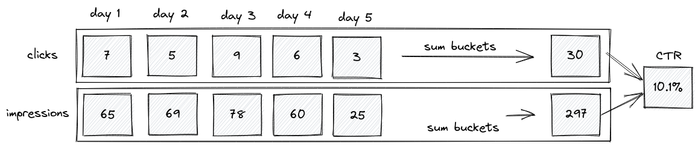

# Delayed feature refresh

All Metarank feature extractors have a common `refresh` parameter. This parameter configures how frequently
the actual ML feature value is updated.

## Why delayed refresh is needed?

Short answer: performance. Long answer: Metarank can compute stateful features, like windowed counter or CTR.
To compute CTR you need not a single click event, but a full history of clicks and impressions 
for a specific time window, and this history can be quite large.

For example, take a look on a common CTR feature defined in the following config snippet:
```yaml
- name: ctr
  type: rate
  top: click
  bottom: impression
  scope: item
  bucket: 24h
  periods: [30, 60, 90]
```

For this CTR definition, metarank will track 90 per-day buckets for clicks and impressions,
having separate write and read paths for it.

When click/impression happens, it only increments a single per-day counter in-place without 
pulling a complete set of 90 buckets from storage, like shown on a diagram below:



When it's time to compute the actual CTR, after the `refresh` period passes, Metarank does the
following:
* load all 90 counters for both clicks and impressions
* sum all per-day counters to compute the final number of clicks and impressions for each 
time window of 30, 60 and 90 days
* divide clicks to impressions and get the CTR for each time window.

The CTR read path is shown in the diagram below:



### Refresh delay is best-effort

Due to performance reasons, the decision to refresh or not refresh the feature value happens
when a new event arrives. Considering this implementation detail, note that there are some
limitations of this approach:
* refresh may happen later than the time period you defined - it will be performed only when
the next event arrives triggering the refresh logic
* in some cases (like in dev environment) when there is not so many events happening,
the refresh may not even happen - for example, you sent a single click event manually and wait
for the CTR feature to update.

## When delayed refresh is not needed

Some non-aggregate user-specific features need to be updated in real-time. For example,
`interacted_with` feature extractor defined with this config snippet:
```yaml
- name: clicked_color
  type: interacted_with
  interaction: click
  field: item.color
  scope: user
```

This feature extractors tracks which colors current user clicked within his session,
and for each product displayed in the ranking it will intersect the product colors with
colors user interacted before.

To make it work within the single session, this ML feature should be updated as fast as possible,
so it has a `0s` default refresh.

We tried to set sensible default values for all feature extractors, but you can always configure
it the way you want.