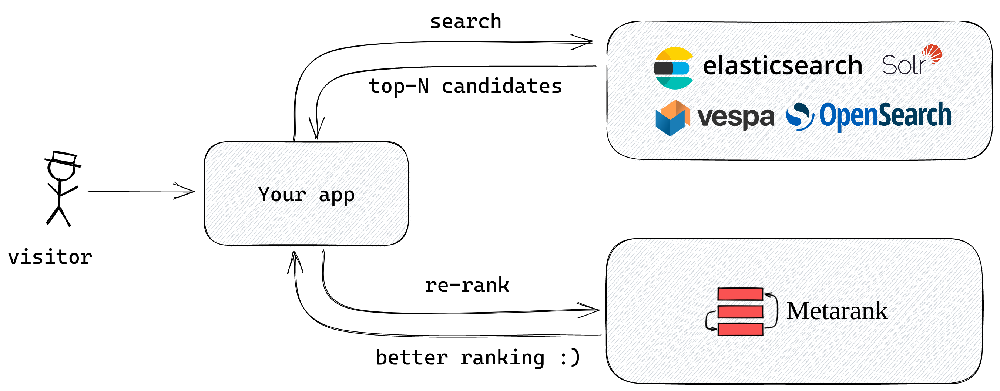

# Search re-ranking with cross-encoder LLMs

In this guide we will set up Metarank as a simple inference server for cross-encoder LLMs. In other words, we will use an open-source cross-encoder model to reorder your search results in a zero-shot manner, without collecting any visitor feedback data. We will use a pre-trained `MS-MARCO MiniLM-L6-v2` cross-encoder from the [sentence-transformers](https://sbert.net) package. 

## What are cross-encoders?

Cross-encoder LLM is a way to leverage the semantic power of neural network to reorder top-N matching documents for your query. You can think about it as asking ChatGPT the following question:
```
For a search query "crocs", reorder the following documents in the decreasing relevance order:
1. Crocs Jibbitz 5-Pack Alien Shoe Charms
2. Crocs Specialist Vent Work
3. Crocs Kids' Baya Clog
```

TODO: add ChatGPT answer

On typical reranking scenarios, cross-encoders (even in zero-shot modes) are much more precise compared to bi-encoders.

## Initial setup

Let's imagine you already have a traditional search engine running (like ElasticSearch, OpenSearch or SOLR), which already has a good [recall](TODO) level - it retrieves all the relevant products, but it sometimes struggles with precision: there can be some false-positives, and the ranking is not perfect.

In this guide we will take a top-N matching documents from your search engine, and re-rank them according to their semantic similarity with the query.



### Importing data

We will use an [Amazon ESCI](TODO) e-commerce dataset as a toy but realistic example: it has 1.7M real products we can easily query with Elasticsearch. You can download the JSON-encoded version here: [https://github.com/shuttie/esci-s](https://github.com/shuttie/esci-s).

Assuming that you have ElasticSearch service running on `http://localhost:9200`, you can import the complete dataset with the following Python script:
```python
import json
from elasticsearch import Elasticsearch

es = Elasticsearch(hosts="http://localhost:9200")

with open('esci.json', 'r') as f:
  for line in f.readlines():
    doc = json.loads(line.rstrip())
      if 'title' in doc:
        # index only title and asin fields
        es.index(index="esci", document={'title': doc['title'], 'asin': doc['asin']})
```

And then we can perform simple keyword searches over the data. For example, we'll search for query "crocs":
```bash
curl -XPOST -d @search.json -H "Content-Type: application/json" http://localhost:9200/esci/_search
```

Where the `search.json` looks like this:
```json
{
  "query": {
    "multi_match": {
      "query" : "crocs", "fields": ["title"]
    }
  },
  "fields": ["asin","title"]
}
```

For this search query, we received 30 matching products, and we're going to take only top-10 of them for further reranking:
```json
{
  "took": 7,
  "timed_out": false,
  "_shards": {
    "total": 1,
    "successful": 1,
    "skipped": 0,
    "failed": 0
  },
  "hits": {
    "total": {
      "value": 30,
      "relation": "eq"
    },
    "max_score": 10.184343,
    "hits": [
      {
        "_index": "esci",
        "_id": "17qoxocBFbzZBgn-7-iy",
        "_score": 10.184343,
        "_source": {
          "title": "Crocs Jibbitz 5-Pack Alien Shoe Charms | Jibbitz for Crocs",
          "asin": "B089YD2KK5"
        },
        "fields": {
          "asin": [
            "B089YD2KK5"
          ],
          "title": [
            "Crocs Jibbitz 5-Pack Alien Shoe Charms | Jibbitz for Crocs"
          ]
        }
      }
    ]
  }
}
```

## Metarank as an inference server

As we got our top-10 search results for reranking, we're now going to configure Metarank in inference mode for cross-encoders. This can be done with the following configuration file:
```yaml
inference:
  msmarco:
    type: cross-encoder
    model: metarank/ce-msmarco-MiniLM-L6-v2
```

After start-up, Metarank will expose it's HTTP API. We're going to hit the `/inference` API route to perform the reranking. See the [API Reference](../api.md#inference-with-llms) for details on payload format:
```bash
curl -XPOST -d @rerank.json -H "Content-Type: application/json" http://metarank:8080/inference/encoder/msmarco
```

Where `rerank.json` request is looking like:
```json
{"input": [
  {"query": "crocs", "title": "Crocs Jibbitz 5-Pack Alien Shoe Charms"},
  {"query": "crocs", "title": "Crocs Specialist Vent Work"},
  {"query": "crocs", "title": "Crocs Kids' Baya Clog"}
]}
```

Metarank will respond with a set of scores, corresponding to the similarity of each query-document pair:
```json
{"scores": [0.756001, 0.52617, 0.193747]}
```

## Cross-encoder latency

Note that due to the LLM inference happening for all document-query pairs, cross-encoders can be quite slow for large reranking windows:
```
Benchmark (batch)                  (model)  Mode  Cnt    Score    Error  Units
encode          1  ce-msmarco-MiniLM-L6-v2  avgt   30   12.298 ±  0.581  ms/op
encode         10  ce-msmarco-MiniLM-L6-v2  avgt   30   58.664 ±  2.064  ms/op
encode        100  ce-msmarco-MiniLM-L6-v2  avgt   30  740.422 ± 13.369  ms/op
```

As it can be seen from the benchmark above, windows of top-100 products may incur a noticeable latency, so try to keep this reranking window reasonably small.