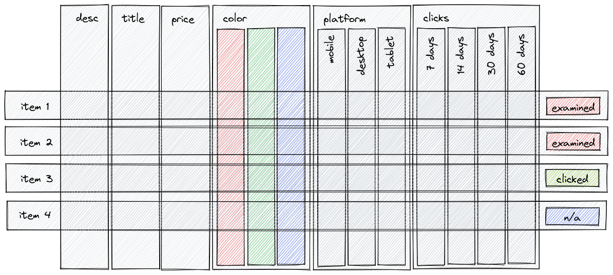

# Automatic model retraining

A problem: how to periodically re-train an ML model on a new data?

## Click-through collection
While receiving and processing incoming events, Metarank collects click-through records:
* On each [ranking event](../event-schema.md#ranking-event), it logs all ML feature values used to produce it. As dynamic features constantly change in time, it allows to easily know, what was the value of any feature back in time.

* Within a default 30-minute window (see a [`core.clickthrough.maxSessionLength`](../configuration/overview.md#core) option for details) all interactions within this ranking event are collected. So you can know which items a visitor has seen, and later interacted with.
* After a click-trough join window is finalized, then ranking, interactions, and feature values are persisted in the store.


These click-through records can be unfolded into an [implicit judgement list](https://softwaredoug.com/blog/2021/02/21/what-is-a-judgment-list.html). A judgement list later can be translated into a ML backend specific training dataset for a LambdaMART model training.

Metarank collects click-through records automatically, you don't need to tune anything to enable this behavior.

## Manual retraining

Given that you have a production Metarank instance running somewhere in the cloud, you can re-train a ML model based on a history of already collected click-through records locally:
```shell
$> java -jar metarank.jar train --config /path/to/config.yml

14:03:26.630 INFO  ai.metarank.main.Main$ - Metarank is starting.
14:03:27.279 INFO  ai.metarank.config.Config$ - api conf block is not defined: using default ApiConfig(Hostname(localhost),Port(8080))
14:03:27.292 INFO  ai.metarank.config.Config$ - Loaded config file, state=redis://Hostname(localhost):Port(6379), features=[position,popularity,vote_avg,vote_cnt,budget,release_date,runtime,title_length,genre,ctr,liked_genre,liked_actors,liked_tags,liked_director,visitor_click_count,global_item_click_count,day_item_click_count], models=[xgboost]
14:03:27.320 INFO  ai.metarank.main.Main$ - usage analytics disabled: METARANK_TRACKING=None isRelease=false
14:03:27.359 INFO  ai.metarank.FeatureMapping - optimized schema: removed 5 unused features
14:03:32.267 INFO  ai.metarank.main.command.Train$ - loaded 8773 clickthroughs, 8773 with clicks
14:03:34.108 INFO  ai.metarank.main.command.Train$ - generated training dataset: 8773 groups, 27 dims
14:03:34.115 INFO  ai.metarank.main.command.Train$ - training model for train=7054 test=1719
14:03:34.773 INFO  i.g.m.l.ranking.pairwise.LambdaMART - [0] NDCG@train = 0.5594632053375398 NDCG@test = 0.5348729264515503
14:03:39.768 INFO  i.g.m.l.ranking.pairwise.LambdaMART - [49] NDCG@train = 0.643993571767862 NDCG@test = 0.5979538819484762
14:03:39.905 INFO  a.m.fstore.redis.RedisPersistence - flushing redis pipeline
14:03:40.920 INFO  a.m.fstore.redis.RedisPersistence - redis pipeline flushed
14:03:40.921 INFO  ai.metarank.main.command.Train$ - model uploaded to store, 693384 bytes
14:03:41.327 INFO  ai.metarank.main.command.Train$ - budget: weight=884.0 zero=24154 nz=186398 dist=[0.00,4500000.00,10000000.00,16000000.00,25000000.00,34000000.00,48000000.00,70000000.00,110000000.00]
14:03:41.328 INFO  ai.metarank.main.command.Train$ - ctr: weight=[1042.0,0.0] zero=1450 nz=419654 dist=[0.03,0.07,0.13,0.19,0.24,0.30,0.43,0.85,1.61]
14:03:41.329 INFO  ai.metarank.main.command.Train$ - genre: weight=[105.0,79.0,77.0,62.0,88.0,63.0,96.0,56.0,93.0,44.0,97.0,58.0,47.0,49.0,46.0] zero=2582113 nz=576167 dist=[0.00,0.00,0.00,0.00,0.00,0.00,0.00,0.00,1.00]
14:03:41.330 INFO  ai.metarank.main.command.Train$ - liked_actors: weight=469.0 zero=198057 nz=12495 dist=[0.00,0.00,0.00,0.00,0.00,0.00,0.00,0.00,0.00]
14:03:41.330 INFO  ai.metarank.main.command.Train$ - liked_director: weight=403.0 zero=206886 nz=3666 dist=[0.00,0.00,0.00,0.00,0.00,0.00,0.00,0.00,0.00]
14:03:41.330 INFO  ai.metarank.main.command.Train$ - liked_genre: weight=1047.0 zero=52726 nz=157826 dist=[0.00,0.00,0.10,0.17,0.22,0.29,0.33,0.46,0.57]
14:03:41.331 INFO  ai.metarank.main.command.Train$ - liked_tags: weight=749.0 zero=149001 nz=61551 dist=[0.00,0.00,0.00,0.00,0.00,0.00,0.01,0.03,0.08]
14:03:41.331 INFO  ai.metarank.main.command.Train$ - position: weight=868.0 zero=8773 nz=201779 dist=[2.00,4.00,7.00,9.00,12.00,14.00,16.00,19.00,21.00]
14:03:41.331 INFO  ai.metarank.main.command.Train$ - release_date: weight=1060.0 zero=533 nz=210019 dist=[555897600.00,728697600.00,822960000.00,900028800.00,974851200.00,1055289600.00,1144800000.00,1244160000.00,1375315200.00]
14:03:41.332 INFO  ai.metarank.main.command.Train$ - runtime: weight=735.0 zero=533 nz=210019 dist=[90.00,95.00,100.00,104.00,108.00,114.00,119.00,127.00,137.00]
14:03:41.332 INFO  ai.metarank.main.command.Train$ - title_length: weight=328.0 zero=533 nz=210019 dist=[1.00,1.00,2.00,2.00,2.00,3.00,3.00,4.00,5.00]
14:03:41.332 INFO  ai.metarank.main.command.Train$ - vote_avg: weight=848.0 zero=533 nz=210019 dist=[5.90,6.20,6.40,6.60,6.80,7.00,7.30,7.50,7.80]
14:03:41.333 INFO  a.m.fstore.redis.client.RedisClient$ - closing redis connection
14:03:41.351 INFO  a.m.fstore.redis.client.RedisClient$ - closing redis connection
14:03:41.356 INFO  a.m.fstore.redis.client.RedisClient$ - closing redis connection
14:03:41.360 INFO  a.m.fstore.redis.client.RedisClient$ - closing redis connection
14:03:41.364 INFO  ai.metarank.main.Main$ - My job is done, exiting.
```

While training, Metarank will do the following steps:
1. Pull all stored click-through records from the store. Your local Metarank config file should be the same as the one use by the serving instance: store config and feature definitions should match.
2. Convert them to a XGBoost/LightGBM compatible judgement lists:

3. Do the ML model training.
4. Upload the model into the store and notify all API serving instances to reload the model.

## Automated retraining

Metarank can be [deployed inside a Kubernetes cluster](../deploy/kubernetes.md) using an official [Helm manifest](https://github.com/metarank/metarank/tree/master/deploy/kubernetes). This Helm manifest's configuration file can create a [Kubernetes CronJob](https://kubernetes.io/docs/concepts/workloads/controllers/cron-jobs/), which will do the same retraining action as described in the previous section, but automatically with a user-defined schedule:

```yaml
train:
  enabled: true
  # retrain all models once a day, at 6AM
  schedule: '"0 6 * * *"'
  # a separate set of resource definitions for model retraining job
  resources: {}
```

You can define a custom cron-compatible schedule using a `train.schedule` option. ML model training may require a lot of resources, so it's recommended to properly define resource configuration, so you won't hit OOM error.

A retraining CronJob is created by default by the Metarank Helm chart, so if you're using it for production deployment, you're ready to go without any configuration changes.