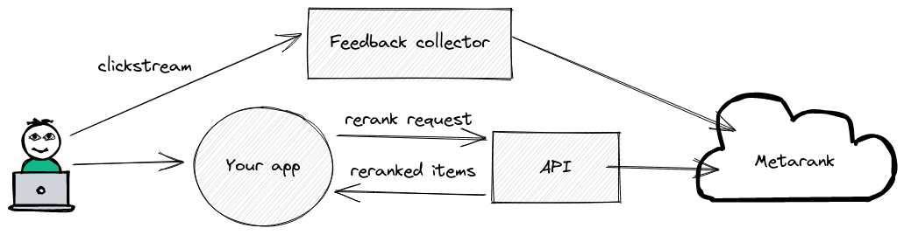

# Metarank event collection

To do it's reranking job, Metarank needs to receive a stream of user actions and item metadata,
describing what items exist, which ones were displayed and how visitor reacted:

Metarank supports multiple ways of collecting this clickstream telemetry events:
* [JSON API](api.md): when you emit [JSON-formatted events](../event-schema.md) explicitly.
* [Snowplow](snowplow.md): when you use a [Snowplow Analytics](https://snowplowanalytics.com) 
for event collection.

Both these ways are identical from the perspective of delivered data, but using existing 
event collectors may save you a lot of integration time.