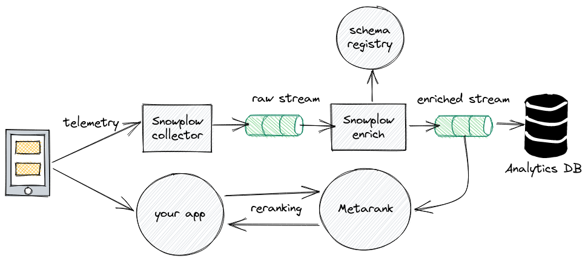
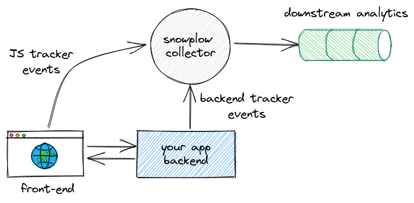
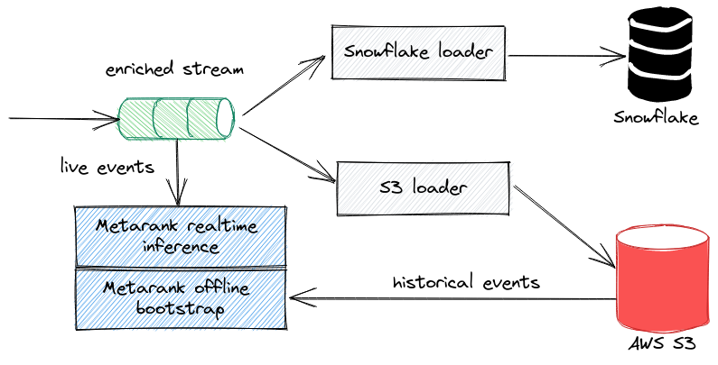

# Snowplow integration


Metarank can be integrated into existing [Snowplow Analytics](https://snowplowanalytics.com/) setup.

We provide a set of [Iglu Schemes](#schema-registry) that you will use to track metadata and interaction events that can
later on be read from Snowplow's enriched event stream by Metarank.

* [Snowplow Trackers](https://docs.snowplowanalytics.com/docs/collecting-data/collecting-from-own-applications/)
are used to track Metarank-specific events.
* Metarank will use Snowplow's enriched event stream as a source of events.

## Typical Snowplow architecture

Typical Snowplow Analytics setup consists of the following parts:
* Using [Snowplow Trackers](https://docs.snowplowanalytics.com/docs/collecting-data/collecting-from-own-applications/), your application emits a clickstream telemetry to the [Stream Collector](https://docs.snowplowanalytics.com/docs/pipeline-components-and-applications/stream-collector/)
* Stream Collector writes all incoming events into the raw stream
* [Enrichment](https://docs.snowplowanalytics.com/docs/pipeline-components-and-applications/enrichment-components/) validates these events according to the predefined schemas from the Schema Registry
* Validated and enriched events are written to the enriched stream
* Enriched events are delivered to the Analytics DB

Metarank exposes a set of Snowplow-compatible event schemas, and can read events
directly from the enriched stream, as shown on the diagram below:



### Schema registry

All incoming raw events have a strict JSON schema, that consists of the following parts:
* predefined fields according to the [Snowplow Tracker Protocol](https://docs.snowplowanalytics.com/docs/collecting-data/collecting-from-own-applications/snowplow-tracker-protocol/)
* unstructured payload with user-defined schema
* multiple context payloads with user-defined schemas

These user-defined schemas are pulled from the [Iglu Registry](https://docs.snowplowanalytics.com/docs/pipeline-components-and-applications/iglu/), 
and these schemas are standard [JSON Schema](https://json-schema.org/specification.html) definitions,
describing the payload structure.

There are four different Metarank event types with the corresponding schemas:
1. `ai.metarank/item/jsonschema/1-0-0`: [item metadata event](https://github.com/metarank/metarank-snowplow/blob/master/schemas/ai.metarank/item/1-0-0)
2. `ai.metarank/user/jsonschema/1-0-0`: [user metadata event](https://github.com/metarank/metarank-snowplow/blob/master/schemas/ai.metarank/user/1-0-0)
3. `ai.metarank/ranking/jsonschema/1-0-0`: [ranking event](https://github.com/metarank/metarank-snowplow/blob/master/schemas/ai.metarank/item/1-0-0)
4. `ai.metarank/interaction/jsonschema/1-0-0`: [interaction event](https://github.com/metarank/metarank-snowplow/blob/master/schemas/ai.metarank/interaction/1-0-0)

These schemas are describing native [Metarank event types](../event-schema.md) without any modifications. 

Check out [github.com/metarank/metarank-snowplow](https://github.com/metarank/metarank-snowplow) for more details about Metarank schemas.

### Stream transport types

Snowplow supports [multiple streaming platforms](https://docs.snowplowanalytics.com/docs/pipeline-components-and-applications/stream-collector/) for event delivery:
* [AWS Kinesis](https://aws.amazon.com/kinesis/): **supported by Metarank**
* [Kafka](https://kafka.apache.org/): **supported by Metarank**
* [GCP Pubsub](https://cloud.google.com/pubsub): *support is [planned in the future](https://github.com/metarank/metarank/issues/477)*
* [NSQ](https://nsq.io/): *not supported*
* [Amazon SQS](https://aws.amazon.com/sqs/): *not supported*
* [stdout]: *not supported*

## Setting up event tracking 

Metarank needs to receive 4 types of [events](../event-schema.md), describing items, users and how users interact with items:
* [item metadata](../event-schema.md#item-metadata-event): like titles, inventory, tags
* [user metadata](../event-schema.md#user-metadata-event): country, age, location
* [ranking](../event-schema.md#ranking-event): what items and in what order were displayed to a visitor
* [interaction](../event-schema.md#interaction-event): how visitor interacted with the ranking

These events can be generated both on the frontend side, and on the backend side, depending on your setup and data availability on the front and back ends.



#### Frontend tracking

Using [Snowplow JS Tracker SDK](https://docs.snowplowanalytics.com/docs/collecting-data/collecting-from-own-applications/javascript-trackers/),
you can track [self-describing events](http://snowplowanalytics.com/blog/2014/05/15/introducing-self-describing-jsons/), which
are JSONs with attached schema references.

An example of tracking a ranking event:

```js
import { trackSelfDescribingEvent } from '@snowplow/browser-tracker';

trackSelfDescribingEvent({
  event: {
    schema: 'iglu:ai.metarank/ranking/jsonschema/1-0-0',
    data: {
        event: 'ranking',
        id: '81f46c34-a4bb-469c-8708-f8127cd67d27',
        timestamp: '1599391467000',
        user: 'user1',
        session: 'session1',
        fields: [
            { name: 'query', value: 'cat' },
            { name: 'source', value: 'search' }
        ],
        items: [
            { id: "item1", relevancy: 2.0 },
            { id: "item2", relevancy: 1.0 }
        ]
    }
  }
});
```

Check out the [JSON-Schema definitions for events](https://github.com/metarank/metarank-snowplow/) and 
[event format](../event-schema.md) articles for details on fields, event types and their meaning.

Metarank schemas are language-agnostic and you can instrument your app using any supported
[Snowplow Tracker SDK](https://docs.snowplowanalytics.com/docs/collecting-data/collecting-from-own-applications/) 
for your favourite language/framework of choice.

#### Backend tracking

It Often happens that the frontend doesn't have all the required information to generate events.
A good example is item metadata event (usually tags, titles and price are altered in some
back-office system and are not directly exposed to the frontend). 

In this case you can generate such events on the backend side.

For a sample Java backend application, you can track an item update event with the following code,
using the [Snowplow Java Tracker SDK](https://docs.snowplowanalytics.com/docs/collecting-data/collecting-from-own-applications/java-tracker/):
```java
import com.snowplowanalytics.snowplow.tracker.*;
import com.snowplowanalytics.snowplow.tracker.emitter.*;
import com.snowplowanalytics.snowplow.tracker.events.Unstructured;
import com.snowplowanalytics.snowplow.tracker.payload.SelfDescribingJson;

import java.util.HashMap;
import java.util.List;
import java.util.Map;

public class JavaTrackerExample {
    public static void main(String[] args) {
        BatchEmitter emitter = BatchEmitter.builder()
                .url("http://collectorEndpoint")
                .build();

        Tracker tracker = new Tracker
                .TrackerBuilder(emitter, "trackerNamespace", "appId")
                .build();

        Map<String, Object> payload = new HashMap<>();
        payload.put("event", "item");
        payload.put("id", "81f46c34-a4bb-469c-8708-f8127cd67d27");
        payload.put("timestamp", String.valueOf(System.currentTimeMillis()));
        payload.put("item", "item1");

        Map<String, Object> fields = new HashMap<>();
        fields.put("title", "your cat");
        fields.put("color", List.of("white", "black"));
        payload.put("fields", fields);

        Unstructured unstructured = Unstructured.builder()
                .eventData(new SelfDescribingJson("iglu:ai.metarank/item/jsonschema/1-0-0", payload))
                .build();

        tracker.track(unstructured);
    }
}
```

## Installing ai.metarank schemas

Metarank schemas are available on a public Iglu server on `https://iglu.metarank.ai`. To use it,
add the following snippet to the `resolver.json` snowplow-enrich config file:
```json
{
  "schema": "iglu:com.snowplowanalytics.iglu/resolver-config/jsonschema/1-0-1",
  "data": {
    "cacheSize": 500,
    "repositories": [
      {
        "name": "Metarank",
        "priority": 0,
        "vendorPrefixes": [ "ai.metarank" ],
        "connection": {
          "http": {
            "uri": "https://iglu.metarank.ai"
          }
        }
      }
    ]
  }
}
```

Both `http` and `https` schemas are supported, but `https` is recommended.

## Connecting Metarank with Snowplow

Snowplow enrich emits processed records in [TSV format](https://docs.snowplowanalytics.com/docs/understanding-your-pipeline/canonical-event/understanding-the-enriched-tsv-format/)
into the downstream Kinesis/Pubsub/etc. topic. This topic is usually later monitored by 
"Loaders", like a Snowflake loader, or [S3 Loader](https://docs.snowplowanalytics.com/docs/pipeline-components-and-applications/loaders-storage-targets/s3-loader).

An example loader integration diagram is shown below:



Snowplow is flexible enough to use different data loading destinations (Redshift, Postgres, 
Snowflake, S3, etc.), but to access both live and historical enriched event data, Metarank needs
an access to:
* Enriched event stream
* Historical enriched stream dumps done with S3 Loader

**At the moment Metarank supports loading historical events only from S3 Loader.**

### Realtime events from AWS Kinesis

Snowplow enrich is usually configured with three destination streams output/pii/bad, with
the same HOCON definition:
```properties
  "output": {
    # Enriched events output
    "good": {
      "type": "Kinesis"

      # Name of the Kinesis stream to write to
      "streamName": "enriched"

      # Optional. Maximum amount of time an enriched event may spend being buffered before it gets sent
      "maxBufferedTime": 100 millis
    }
  }
```

To make metarank connect to this stream, configure the 
[kinesis source](../data-sources.md#aws-kinesis-streams) in the following way:
```yaml
inference:
  port: 8080
  host: "0.0.0.0"
  source:
    type: kinesis
    region: us-east-1
    topic: enriched
    offset: latest
    format: snowplow:tsv
```

All the supported Metarank sources have an optional `format` field, which defines the
underlying format of the payload in this stream. Valid options are:
* `json`: default value, Metarank native format
* `snowplow`, `snowplow:tsv`: Snowplow default TSV stream format
* `snowplow:json`: Snowplow optional JSON stream format

With the `format: snowplow:tsv`, Metarank will read TSV events and transform them into native
format automatically.

### Historical events from AWS S3

[Snowplow S3 Loader](https://docs.snowplowanalytics.com/docs/pipeline-components-and-applications/loaders-storage-targets/s3-loader) 
offloads realtime enriched events to gzip/lzo compressed files on S3.
Given the following [sample S3 Loader config snippet](https://github.com/snowplow/snowplow-s3-loader/blob/master/config/config.hocon.sample):
```properties
{
  # Optional, but recommended
  "region": "us-east-1",

  # Options are: RAW, ENRICHED_EVENTS, JSON
  "purpose": "ENRICHED_EVENTS",

  # Input Stream config
  "input": {
    # Kinesis Client Lib app name (corresponds to DynamoDB table name)
    "appName": "acme-s3-loader",
    # Kinesis stream name
    "streamName": "enriched",
    # Options are: LATEST, TRIM_HORIZON, AT_TIMESTAMP
    "position": "LATEST",
    # Max batch size to pull from Kinesis
    "maxRecords": 10
  },

  "output": {
    "s3": {
      # Full path to output data
      "path": "s3://acme-snowplow-output/enriched/",

      # Partitioning format; Optional
      # Valid substitutions are {vendor}, {schema}, {format}, {model} for self-describing jsons
      # and {yy}, {mm}, {dd}, {hh} for year, month, day, hour
      partitionFormat: "{vendor}.{schema}/model={model}/date={yy}-{mm}-{dd}"

      # Output format; Options: GZIP, LZO
      "compression": "GZIP"
    }
  }
}
```

You can instrument Metarank to load these GZIP-compressed event dumps for the bootstrapping
process with the [file source](../data-sources.md) in the following way:
```yaml
bootstrap:
  source:
    type: file
    path: "s3://acme-snowplow-output/enriched/"
    offset: earliest
    format: snowplow:tsv
```

## Validating the setup

With Metarank configured to pick live events from the enriched stream, and historical events
from the offloaded files in S3, it should be straightforward to do the usual routine of
[setting up](../configuration.md) and [running it](../deploy/README.md) Metarank.
