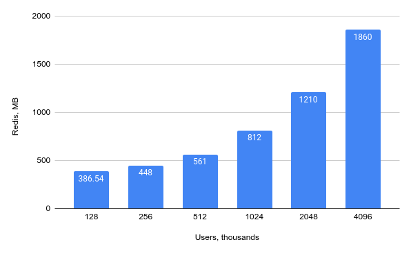

# Performance

Metarank is a secondary reranker: it's an extra **non-free** step in your retrieval process. In a common scenario, you should expect the following trade-offs:
 
* Re-ranking latency: 10-30 ms
* Redis memory usage: 1-10 GiB
* Data import throughput: 1000-2000 events/second.

## Response latency

On a [RankLens](https://github.com/metarank/ranklens) dataset in a [synthetic latency test](https://github.com/metarank/metarank/blob/master/src/test/scala/ai/metarank/util/VersionTest.scala) we observed the following latency distribution:

Each Metarank installation is unique, but there are common things affecting the overall latency:
* [**state encoding format**](configuration/persistence.md#state-encoding-formats): `binary` is faster than `json` due to its compact representation.
* **Metarank-Redis network latency**: Metarank pulls all features for all re-ranked items in a single large batch. There are no multiple network calls, and only a constant overhead. 
* **Request size**: the more items you ask to re-rank, the more data needs to be loaded.
* [**Number of feature extractors**](configuration/feature-extractors.md): the more per-item features are defined in config, the more data is loaded during the request processing.

So while planning your set-up, expect Metarank to be within **20-30 ms** latency budget.

## Memory usage

Using the same reference [RankLens](https://github.com/metarank/ranklens) dataset, we built a fuzzy [synthetic dataset generator](https://github.com/metarank/metarank/blob/master/src/test/scala/ai/metarank/util/SyntheticRanklensDataset.scala) and generated the following dataset variations:

* N users, 1000 items.
* Each user made 10 rankings within a single session.
* Each ranking has 2 clicks made by the user.

Metarank only tracks aggregated data required for the re-ranking, and does not store raw events. Memory usage depends on the following characteristics of your set-up:

* **Number of unique users**: per-user click-through events are used as an input for the ML model training.
* **Number of items**: if you define per-item feature extractors (like [`string`](configuration/features/scalar.md#string-extractors) or [`number`](configuration/features/scalar.md#numerical-extractor)), current point-in-time values of used fields are persisted.
* **Number of users**: if you define per-user features like [`interacted_with`](configuration/features/user-session.md#interacted-with), then we persist a per-user list of interacted items.
* **Number of features**: stored click-through events also contain snapshots of all per-item feature values used to build the ranking back in time. 

The resulting memory usage for a `binary` state encoding format and `Redis` as a persistence store are shown in the diagram below:

According to the diagram, the Metarank itself has a very low RAM usage (around 40-50MiB JVM heap used), as it's stateless and uses Redis for the whole dataset management.

 So while planning your set-up, expect Metarank to use around **1.5 GiB per 100k users**.