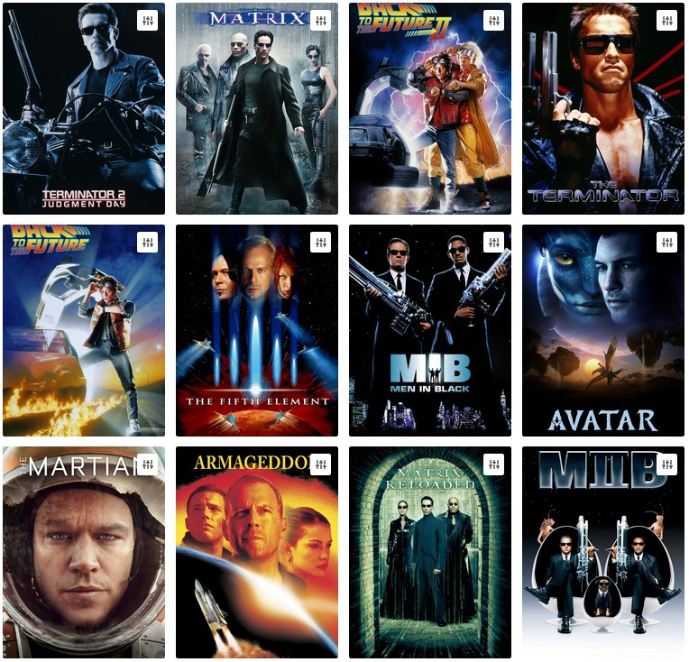
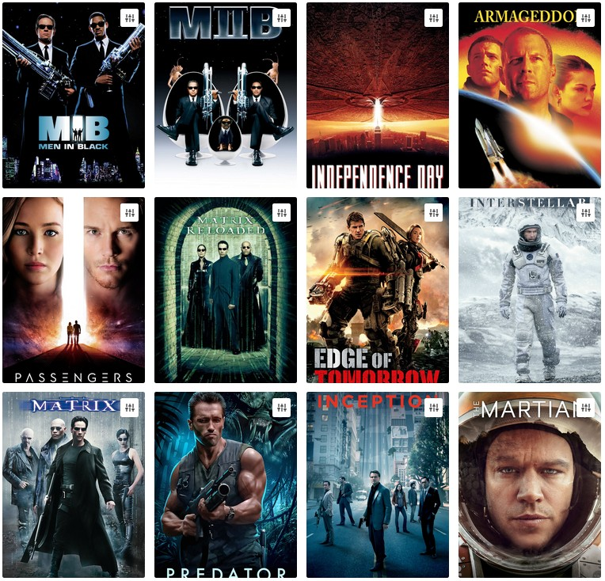

# Quickstart

This guide shows how to install and run Metarank on a single machine using Docker. We will run the service, feed it with
sample data and issue queries.

## Prerequisites

* Docker: [Docker Desktop for Mac/Windows](https://docs.docker.com/engine/install/), or Docker for Linux
* Operating system: Linux, macOS, or Windows 10+
* Architecture: x86_64. For M1, see [Apple M1 support](../installation.md#installing-on-macos)
* Memory: 2Gb dedicated to Docker

This guide is tested with Docker for linux v20.10.16, and [metarank/metarank:0.5.1](https://hub.docker.com/r/metarank/metarank/tags) docker image.

## Getting the dataset

For the quickstart, we will use an open [RankLens](https://github.com/metarank/ranklens) dataset and personalize
a set of pre-computed movie recommendations based on visitor activity. 
The dataset is used to build a [Metarank Demo](https://demo.metarank.ai/) website and includes the following event types:
 
<details><summary>Movie metadata: genres, actors, tags, votes.</summary>

```json
{
  "id": "b4951b85-a87f-4fdc-b2af-9ff06783def4",
  "item": "3114",
  "timestamp": "1636907100000",
  "fields": [
    {"name": "title", "value": "Toy Story 2"}, 
    {"name": "popularity", "value": 112.767},
    {"name": "vote_avg", "value": 7.6},
    {"name": "vote_cnt", "value": 11025.0},
    {"name": "budget", "value": 9.0E+7},
    {"name": "runtime", "value": 92.0},
    {"name": "release_date", "value": 9.412416E+8},
    {"name": "genres", "value": ["animation", "comedy", "family"]},
    {"name": "tags", "value": ["pixar", "disney", "animation", "sequel"]},
    {"name": "actors", "value": ["tom hanks", "joan cusack", "frank welker"]},
    {"name": "director", "value": "john lasseter"},
    {"name": "writer", "value": "andrew stanton"}
  ],
  "event": "item"
}
```

</details>

<details><summary>Visitor impressions: what was displayed to a visitor</summary>

```json
{
  "event": "ranking",
  "id": "id1",
  "items": [
    {"id":"72998"},  {"id":"67197"},  {"id":"77561"},  {"id":"68358"},
    {"id":"72378"},  {"id":"85131"},  {"id":"94864"},  {"id":"68791"},
    {"id":"109487"}, {"id":"59315"},  {"id":"120466"}, {"id":"90405"},
    {"id":"117529"}, {"id":"130490"}, {"id":"92420"},  {"id":"122882"},
    {"id":"113345"}, {"id":"2571"},   {"id":"122900"}, {"id":"88744"},
    {"id":"95875"},  {"id":"60069"},  {"id":"2021"},   {"id":"135567"},
    {"id":"122902"}, {"id":"104243"}, {"id":"112852"}, {"id":"102880"},
    {"id":"96610"},  {"id":"741"},    {"id":"166528"}, {"id":"164179"},
    {"id":"71057"},  {"id":"3527"},   {"id":"6365"},   {"id":"6934"},
    {"id":"114935"}, {"id":"8810"},   {"id":"173291"}, {"id":"1580"},
    {"id":"1917"},   {"id":"135569"}, {"id":"106920"}, {"id":"1240"},
    {"id":"85056"},  {"id":"780"},    {"id":"1527"},   {"id":"5459"},
    {"id":"8644"},   {"id":"60684"},  {"id":"7254"},   {"id":"44191"},
    {"id":"97752"},  {"id":"2628"},   {"id":"541"},    {"id":"106002"},
    {"id":"2012"},   {"id":"79357"},  {"id":"6283"},   {"id":"113741"},
    {"id":"27660"},  {"id":"34048"},  {"id":"1882"},   {"id":"1748"},
    {"id":"34319"},  {"id":"1097"},   {"id":"115713"}, {"id":"2916"}
  ],
  "user": "alice",
  "session": "alice1",
  "timestamp": 1661345221008
}
```
</details>

<details><summary>Visitor interactions: which movies the visitor liked after observing the ranking.</summary>

```json
{
  "id": "580a09e9-a002-4d59-a527-a556a38aa04f",
  "item": "4002",
  "timestamp": "1636993839000",
  "ranking": "84074af6-25fb-4791-81da-2f622871b194", 
  "user": "90df34e521cc3d53af5f42f5c16ecb60",
  "session": "90df34e521cc3d53af5f42f5c16ecb60",
  "type": "click",
  "fields": [],
  "event": "interaction"
}
```
</details>

For this quickstart, you need two files from the dataset:
1. [config.yml](https://raw.githubusercontent.com/metarank/metarank/master/src/test/resources/ranklens/config.yml) - metarank
configuration file used in the [demo.metarank.ai](https://demo.metarank.ai), describing how to map visitor events to ML features. 
For your own dataset, you don't always need to write this file from scratch, Metarank can automatically try to deduce 
most typical feature mappings based on your dataset. See [Autofeature](../howto/autofeature.md) for details.
2. [events.jsonl.gz](https://github.com/metarank/metarank/blob/master/src/test/resources/ranklens/events/events.jsonl.gz) - 
a dump of historical visitor interactions used for ML training.

```bash
curl -o config.yml https://raw.githubusercontent.com/metarank/metarank/master/src/test/resources/ranklens/config.yml
```

```bash
curl -o events.jsonl.gz https://media.githubusercontent.com/media/metarank/metarank/master/src/test/resources/ranklens/events/events.jsonl.gz
```
```bash
ls -l

total 172
drwxr-xr-x  2 user user   4096 Aug 23 14:24 .
drwxr-xr-x 81 user user  16384 Aug 23 14:24 ..
-rw-r--r--  1 user user   2542 Aug 23 14:24 config.yml
-rw-r--r--  1 user user 150264 Aug 23 14:24 events.jsonl.gz

```

## Running Metarank in Docker

```bash
docker run -i -t -p 8080:8080 -v $(pwd):/opt/metarank\ 
    metarank/metarank:0.5.6 standalone\
    --config /opt/metarank/config.yml\
    --data /opt/metarank/events.jsonl.gz
```

This command will:
* run the dataset import process from the current directory,
* train the [ML model for ranking](/doc/configuration/supported-ranking-models.md),
* start the [API](../api.md) on port 8080.


## First query

We're going to send a set of initial candidates for reranking into Metarank's REST API `/rank` endpoint for an 
`xgboost` model defined in config.yml. Let's take top-100 popular movies tagged as Sci-Fi, and ask Metarank to reorder 
them to maximize CTR:

```bash
curl http://localhost:8080/rank/xgboost -d '{
    "event": "ranking",
    "id": "id1",
    "items": [
        {"id":"72998"}, {"id":"67197"}, {"id":"77561"}, {"id":"68358"}, {"id":"79132"}, {"id":"103228"}, 
        {"id":"72378"}, {"id":"85131"}, {"id":"94864"}, {"id":"68791"}, {"id":"93363"}, {"id":"112623"}, 
        {"id":"109487"}, {"id":"59315"}, {"id":"120466"}, {"id":"90405"}, {"id":"122918"}, {"id":"70286"}, 
        {"id":"117529"}, {"id":"130490"}, {"id":"92420"}, {"id":"122882"}, {"id":"87306"}, {"id":"82461"}, 
        {"id":"113345"}, {"id":"2571"}, {"id":"122900"}, {"id":"88744"}, {"id":"111360"}, {"id":"134130"}, 
        {"id":"95875"}, {"id":"60069"}, {"id":"2021"}, {"id":"135567"}, {"id":"103253"}, {"id":"111759"},
        {"id":"122902"}, {"id":"104243"}, {"id":"112852"}, {"id":"102880"}, {"id":"56174"}, {"id":"107406"}, 
        {"id":"96610"}, {"id":"741"}, {"id":"166528"}, {"id":"164179"}, {"id":"187595"}, {"id":"589"}, 
        {"id":"71057"}, {"id":"3527"}, {"id":"6365"}, {"id":"6934"}, {"id":"1270"}, {"id":"6502"}, 
        {"id":"114935"}, {"id":"8810"}, {"id":"173291"}, {"id":"1580"}, {"id":"182715"}, {"id":"166635"}, 
        {"id":"1917"}, {"id":"135569"}, {"id":"106920"}, {"id":"1240"}, {"id":"5502"}, {"id":"316"},
        {"id":"85056"}, {"id":"780"}, {"id":"1527"}, {"id":"5459"}, {"id":"94018"}, {"id":"33493"}, 
        {"id":"8644"}, {"id":"60684"}, {"id":"7254"}, {"id":"44191"}, {"id":"101864"}, {"id":"132046"}, 
        {"id":"97752"}, {"id":"2628"}, {"id":"541"}, {"id":"106002"}, {"id":"1200"}, {"id":"5378"}, 
        {"id":"2012"}, {"id":"79357"}, {"id":"6283"}, {"id":"113741"}, {"id":"90345"}, {"id":"2011"}, 
        {"id":"27660"}, {"id":"34048"}, {"id":"1882"}, {"id":"1748"}, {"id":"2985"}, {"id":"104841"}, 
        {"id":"34319"}, {"id":"1097"}, {"id":"115713"}, {"id":"2916"}
    ],
    "user": "alice",
    "session": "alice1",
    "timestamp": 1661431892711
}'
```

The API will respond with a list of 100 re-ranked movie ids:
```json5
{
  "items": [
    {"item": "72998",  "score": 2.0272045135498047},
    {"item": "589",    "score": 1.838820457458496},
    {"item": "134130", "score": 1.7281458377838135},
    {"item": "5459",   "score": 1.7237709760665894},
    {"item": "1917",   "score": 1.7038706541061401},
    {"item": "2571",   "score": 1.6998087167739868},
    {"item": "1527",   "score": 1.6812316179275513},
    {"item": "97752",  "score": 1.6692591905593872},
    {"item": "1270",   "score": 1.648807406425476},
    {"item": "1580",   "score": 1.5384368896484375},
    {"item": "109487", "score": 1.5244081020355225},
    {"item": "79132",  "score": 1.4934355020523071},
    // other 88 items are skipped
  ]
}
```

Which looks like a diverse set of sci-fi movies with some generic non-personalized ranking, as we haven't sent any 
interaction events yet.



## Sending visitor feedback

Metarank expects to receive impression events (what was displayed to the visitor) and interaction events (what the visitor
did after seeing the listing). 

Impression event contains only the items that were displayed to the user, so if your response is paginated, impression event will indicate
only items from the current page.

In our case, the impression event is a set of top 12 movies from the previous `/rank` request, 
starting with `Terminator 2` and ending with `MIIB`:
```bash
curl http://localhost:8080/feedback -d '{
    "event": "ranking",
    "id": "id1",
    "items": [
        {"id":"72998"}, {"id":"589"}, {"id":"134130"}, {"id":"5459"}, 
        {"id":"1917"}, {"id":"2571"}, {"id":"1527"}, {"id":"97752"}, 
        {"id":"1270"}, {"id":"1580"}, {"id":"109487"}, {"id":"79132"}
    ],
    "user": "alice",
    "session": "alice1",
    "timestamp": 1661431894711
}'
```

Now let's send a click on `Men in Black` with id=1580:
```bash
curl http://localhost:8080/feedback -d '{
    "event": "interaction",
    "type": "click",
    "id": "id2",
    "ranking": "id1",
    "item": "1580",
    "user": "alice",
    "session": "alice1",
    "timestamp": 1661431896711
}'
```

## Getting personalized ranking

Now, we are ready to get some personalized!

Let's send the same first ranking request with top-100 sci-fi movies we did before, and see how response will change 
after providing some visitor feedback:
```bash
curl http://localhost:8080/rank/xgboost -d '{
    "event": "ranking",
    "id": "id1",
    "items": [
        {"id":"72998"}, {"id":"67197"}, {"id":"77561"}, {"id":"68358"}, {"id":"79132"}, {"id":"103228"}, 
        {"id":"72378"}, {"id":"85131"}, {"id":"94864"}, {"id":"68791"}, {"id":"93363"}, {"id":"112623"}, 
        {"id":"109487"}, {"id":"59315"}, {"id":"120466"}, {"id":"90405"}, {"id":"122918"}, {"id":"70286"}, 
        {"id":"117529"}, {"id":"130490"}, {"id":"92420"}, {"id":"122882"}, {"id":"87306"}, {"id":"82461"}, 
        {"id":"113345"}, {"id":"2571"}, {"id":"122900"}, {"id":"88744"}, {"id":"111360"}, {"id":"134130"}, 
        {"id":"95875"}, {"id":"60069"}, {"id":"2021"}, {"id":"135567"}, {"id":"103253"}, {"id":"111759"},
        {"id":"122902"}, {"id":"104243"}, {"id":"112852"}, {"id":"102880"}, {"id":"56174"}, {"id":"107406"}, 
        {"id":"96610"}, {"id":"741"}, {"id":"166528"}, {"id":"164179"}, {"id":"187595"}, {"id":"589"}, 
        {"id":"71057"}, {"id":"3527"}, {"id":"6365"}, {"id":"6934"}, {"id":"1270"}, {"id":"6502"}, 
        {"id":"114935"}, {"id":"8810"}, {"id":"173291"}, {"id":"1580"}, {"id":"182715"}, {"id":"166635"}, 
        {"id":"1917"}, {"id":"135569"}, {"id":"106920"}, {"id":"1240"}, {"id":"5502"}, {"id":"316"},
        {"id":"85056"}, {"id":"780"}, {"id":"1527"}, {"id":"5459"}, {"id":"94018"}, {"id":"33493"}, 
        {"id":"8644"}, {"id":"60684"}, {"id":"7254"}, {"id":"44191"}, {"id":"101864"}, {"id":"132046"}, 
        {"id":"97752"}, {"id":"2628"}, {"id":"541"}, {"id":"106002"}, {"id":"1200"}, {"id":"5378"}, 
        {"id":"2012"}, {"id":"79357"}, {"id":"6283"}, {"id":"113741"}, {"id":"90345"}, {"id":"2011"}, 
        {"id":"27660"}, {"id":"34048"}, {"id":"1882"}, {"id":"1748"}, {"id":"2985"}, {"id":"104841"}, 
        {"id":"34319"}, {"id":"1097"}, {"id":"115713"}, {"id":"2916"}
    ],
    "user": "alice",
    "session": "alice1",
    "timestamp": 1661431898711
}'
```

As you can see, the response is quite different from the first attempt:
```json5
{
  "items": [
    {"item": "1580",   "score": 3.345952033996582},
    {"item": "5459",   "score": 2.873959541320801},
    {"item": "8644",   "score": 2.500633478164673},
    {"item": "56174",  "score": 2.2979140281677246},
    {"item": "2571",   "score": 2.0133864879608154},
    {"item": "1270",   "score": 1.807900071144104},
    {"item": "109487", "score": 1.7143194675445557},
    {"item": "589",    "score": 1.706472396850586},
    {"item": "780",    "score": 1.7030035257339478},
    {"item": "1527",   "score": 1.6445566415786743},
    {"item": "60069",  "score": 1.6372750997543335},
    {"item": "1917",   "score": 1.6299139261245728}
    // other 88 items skipped
  ]
}
```


Ranking was adjusted to a taste of the visitor, we can see that:
* `Men in Black 2` went to the top, as it has similar tags and actors.
* other space movies also went up (like `Armageddon`), as they're also space-related.
* both parts of `Back to the Future` went significantly down, as not related to past visitor's clicks.

## What's next?

* play with the contents of [config.yml](/doc/configuration/overview.md), enabling and disabling different features and see 
how ranking changes depending on used features.
* generate your own set of [input events](../event-schema.md), describing your use case.
